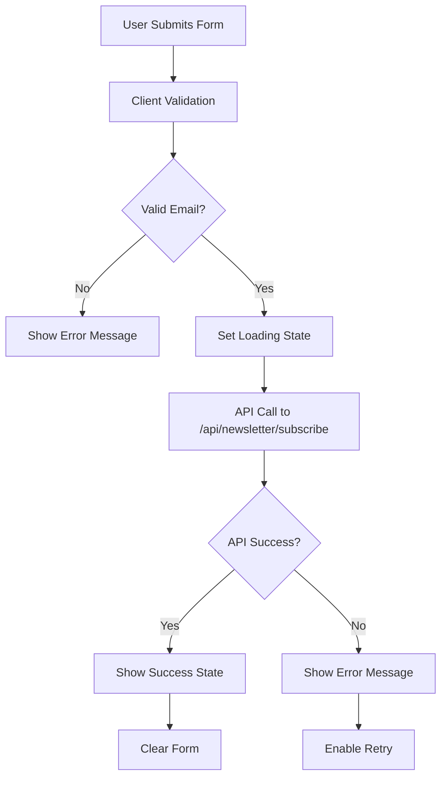

# StrayLight Newsletter Architecture

## Overview

This document outlines the architecture and design decisions for the StrayLight newsletter system, including both the home page implementation and the miniature newsletter components deployed across specific subpages.

## System Architecture

### Component Hierarchy

```
Newsletter System
├── HomeNewsletterSignup (Home page - existing)
│   ├── Full-featured form component
│   ├── Success state with celebration
│   └── Error handling
│
├── MiniNewsletterSignup (Subpages - new)
│   ├── Page detection logic
│   ├── Scaled-down UI preserving design language
│   ├── Same functionality as home version
│   └── Enhanced accessibility features
│
└── Shared Infrastructure
    ├── API endpoint: /api/newsletter/subscribe
    ├── Mailchimp integration
    ├── Supabase database storage
    └── Email validation services
```

### File Structure

```
src/
├── components/
│   ├── HomeNewsletterSignup.tsx      # Home page newsletter (existing)
│   └── MiniNewsletterSignup.tsx      # Miniature version (new)
│
├── app/
│   ├── page.tsx                      # Home page (uses HomeNewsletterSignup)
│   ├── about/page.tsx                # About page (uses MiniNewsletterSignup)
│   ├── library/page.tsx              # Library page (uses MiniNewsletterSignup)
│   └── api/newsletter/subscribe/
│       └── route.ts                  # Shared API endpoint
│
└── components/
    └── ArticlesPageContent.tsx       # Articles pages (uses MiniNewsletterSignup)
```

## Design Decisions

### 1. Component Separation Strategy

**Decision**: Create separate components instead of a single configurable component.

**Rationale**:

- **Clear responsibility separation**: Home page has different requirements than subpages
- **Performance optimization**: Each component optimized for its specific use case
- **Maintainability**: Easier to modify one without affecting the other
- **Bundle size**: No unnecessary props or conditional logic

### 2. Page Detection Logic

**Implementation**:

```typescript
useEffect(() => {
  const path = window.location.pathname;
  const targetPaths = ['/articles', '/about', '/library'];

  const shouldShow = targetPaths.some(
    (targetPath) => path === targetPath || path.startsWith(targetPath + '/')
  );

  setShouldRender(shouldShow);
}, []);
```

**Rationale**:

- **Client-side detection**: Allows for dynamic rendering based on current route
- **Flexible path matching**: Supports both exact matches and sub-routes
- **Performance**: Early return if not on target pages
- **Future-proof**: Easy to add/remove target pages

### 3. Visual Design Preservation

**Strategy**: Proportional scaling while maintaining design language.

**Scaling Ratios**:

- **Padding**: `80px 120px` → `32px 48px` (60% reduction)
- **Typography**: `text-4xl md:text-5xl` → `text-xl md:text-2xl` (2 levels down)
- **Spacing**: Proportionally reduced but maintained hierarchy
- **Interactive elements**: Preserved original sizing for usability

**Preserved Elements**:

- Pill-shaped container (`borderRadius: '9999px'`)
- Backdrop blur and transparency effects
- Color palette and opacity levels
- Font families (`font-inter`, `font-source`)
- Hover and focus states
- Loading animations

### 4. Enhanced Accessibility

**New Features Added**:

```typescript
// Semantic HTML structure
<div role="region" aria-label="Newsletter subscription">
  <label htmlFor="mini-newsletter-email" className="sr-only">
    Adres email
  </label>
  <input
    id="mini-newsletter-email"
    aria-describedby={status === 'error' ? 'mini-newsletter-error' : undefined}
  />
  <div id="mini-newsletter-error" role="alert" aria-live="polite">
</div>
```

**Benefits**:

- **Screen reader support**: Proper ARIA labels and roles
- **Keyboard navigation**: Full tab order and focus management
- **Error announcement**: Live regions for dynamic content
- **Context awareness**: Descriptive labels for form elements

### 5. State Management Architecture

**State Structure**:

```typescript
interface NewsletterState {
  email: string; // Form input value
  status: 'idle' | 'loading' | 'success' | 'error';
  errorMessage: string; // User-friendly error text
  shouldRender: boolean; // Page detection result
}
```

**State Flow**:

1. **Initial**: `idle` state, empty form
2. **Submission**: `loading` state, disable form, show spinner
3. **Success**: `success` state, show celebration message
4. **Error**: `error` state, show error message, enable retry

### 6. API Integration Strategy

**Shared Infrastructure**:

- **Single endpoint**: `/api/newsletter/subscribe` used by both components
- **Consistent payload**: Same data structure for both implementations
- **Error handling**: Unified error responses and messages
- **Validation**: Server-side validation with client-side enhancement

**Enhanced Client Validation**:

```typescript
const isValidEmail = (email: string): boolean => {
  const emailRegex = /^[^\s@]+@[^\s@]+\.[^\s@]+$/;
  return emailRegex.test(email);
};
```

## Implementation Flow

### Page Load Sequence

```mermaid
graph TD
    A[Page Loads] --> B[MiniNewsletterSignup Mounts]
    B --> C[useEffect Runs]
    C --> D[Check window.location.pathname]
    D --> E{Is Target Page?}
    E -->|Yes| F[setShouldRender(true)]
    E -->|No| G[setShouldRender(false)]
    F --> H[Render Component]
    G --> I[Return null]
```

### Form Submission Flow



## Performance Considerations

### Bundle Size Optimization

**Strategies**:

- **Conditional rendering**: Component only renders on target pages
- **Tree shaking**: Unused exports are eliminated during build
- **Shared dependencies**: Leverages existing Tailwind classes and React hooks
- **No external dependencies**: Uses built-in browser APIs and existing infrastructure

### Runtime Performance

**Optimizations**:

- **Single useEffect**: Page detection runs only once on mount
- **Early returns**: Immediate null return for non-target pages
- **Debounced validation**: Email validation occurs on submit, not on every keystroke
- **Memoized handlers**: Event handlers are stable across re-renders

### Network Efficiency

**Benefits**:

- **Shared API endpoint**: No additional network infrastructure
- **Cached resources**: Reuses existing Tailwind styles and fonts
- **Minimal payload**: Only essential data sent to server

## Security Considerations

### Input Validation

**Client-side** (UX enhancement):

```typescript
if (!isValidEmail(email.trim())) {
  setStatus('error');
  setErrorMessage('Proszę podać prawidłowy adres email.');
  return;
}
```

**Server-side** (Security critical):

- Zod schema validation
- Email format verification
- Rate limiting (inherited from existing API)
- CSRF protection (inherited from Next.js)

### Data Privacy

**Compliance Features**:

- **Explicit consent**: Privacy notice displayed on form
- **Data minimization**: Only email and basic info collected
- **Secure transmission**: HTTPS enforced
- **GDPR compliance**: Inherited from existing Mailchimp integration

## Testing Strategy

### Component Testing

**Areas Covered**:

- **Page detection logic**: Verify correct targeting
- **Form validation**: Test email validation rules
- **State transitions**: Ensure proper loading/success/error states
- **Accessibility**: Verify ARIA attributes and keyboard navigation
- **Responsive design**: Test across multiple screen sizes

### Integration Testing

**Scenarios**:

- **API connectivity**: Verify successful subscription flow
- **Error handling**: Test network failures and invalid responses
- **Cross-page consistency**: Ensure behavior matches across target pages
- **Mailchimp integration**: Verify subscribers appear in audience

### Performance Testing

**Metrics**:

- **Bundle impact**: Measure size increase from new component
- **Runtime performance**: Check for memory leaks or excessive re-renders
- **Load time impact**: Verify no degradation on target pages

## Monitoring and Analytics

### Success Metrics

**Key Performance Indicators**:

- **Conversion rate**: Newsletter signups per page view
- **User engagement**: Time between page load and signup
- **Error rate**: Failed submissions vs successful ones
- **Cross-page comparison**: Performance differences between pages

### Error Tracking

**Monitored Events**:

- **API failures**: Network errors and server responses
- **Validation failures**: Client-side validation rejections
- **Render failures**: Component mount/unmount issues
- **Browser compatibility**: Issues across different browsers/devices

## Future Enhancements

### Planned Improvements

1. **A/B Testing Framework**
   - Different messaging variations
   - Button text optimization
   - Color scheme testing

2. **Enhanced Analytics**
   - Conversion funnel tracking
   - User behavior heatmaps
   - Performance monitoring dashboard

3. **Personalization**
   - Dynamic content based on page context
   - User preference detection
   - Localization support

4. **Progressive Enhancement**
   - Offline capability
   - Service worker integration
   - Enhanced error recovery

### Scalability Considerations

**Architecture Supports**:

- **Additional pages**: Easy to extend target page list
- **Multiple variants**: Component structure allows for specialized versions
- **Internationalization**: Text externalization ready for translation
- **Theme variations**: Design system ready for brand updates

## Conclusion

The miniature newsletter architecture balances several competing concerns:

- **Consistency**: Maintains visual and functional consistency with the home page
- **Performance**: Minimal impact on bundle size and runtime performance
- **Maintainability**: Clear separation of concerns and well-documented interfaces
- **Accessibility**: Enhanced support for all users and assistive technologies
- **Scalability**: Flexible architecture supporting future enhancements

The implementation successfully delivers a cohesive user experience across multiple pages while maintaining the technical excellence expected in a modern web application.
